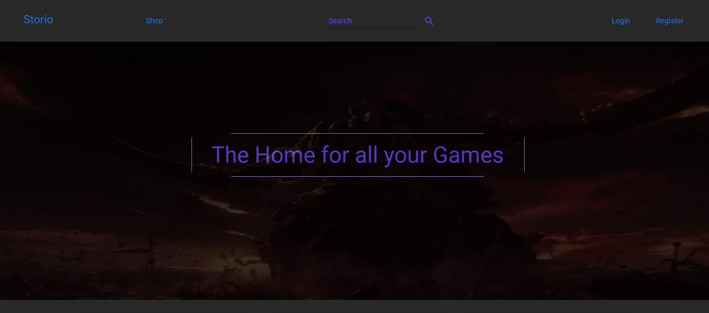
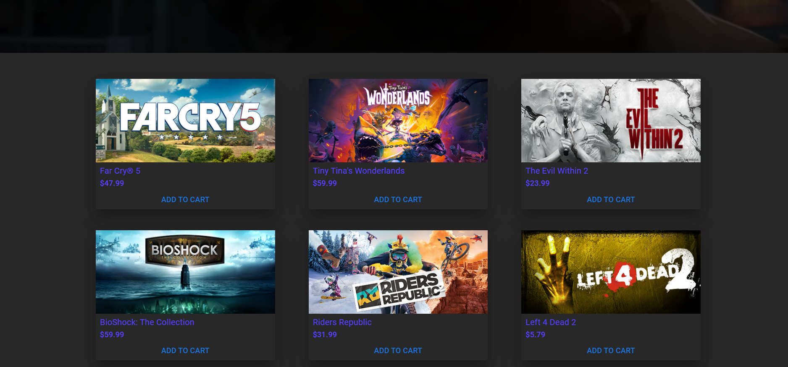
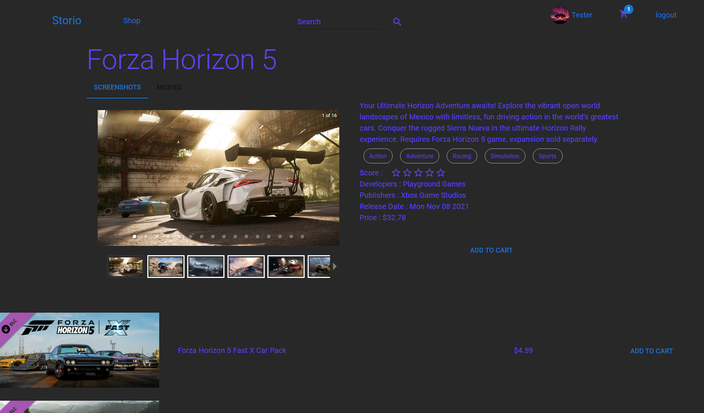

# Storio Game Shop

[](https://opensource.org/licenses/MIT)

**Welcome to Storio!** 🎮 Your ultimate destination for an immersive gaming experience. Storio is a cutting-edge game shop built with Node.js and React, designed to provide you with a seamless and enjoyable journey through the world of gaming.





## 🚀 Features
- Browse through a diverse collection of games 🌐
- Search for specific games or genres 🔍
- View detailed information about each game 📖
- Add games to your cart and proceed to checkout 🛒
- Secure payments with Stripe integration 💳
- User authentication using JWT for a personalized experience 🔐
- Access your order history and details 📦
- Responsive design for an optimal viewing experience on all devices 📱💻

## 🛠 Getting Started

### Prerequisites
Make sure you have the following installed on your machine:
- [Node.js](https://nodejs.org/)
- [npm](https://www.npmjs.com/) (Node Package Manager)

### Installation
1. **Clone the repository**
   ```bash
   git clone https://github.com/Ibrakristo/Shop.git
   ```
2. **Navigate to the project directory**
   ```bash
   cd Shop
   ```
3. **Install dependencies**
   ```bash
   npm install
   ```

## 🎮 Usage

1. **Start the development server**
   ```bash
   npm start
   ```
## Notes
1. You need to have a STRIPEKEY, a MONGODBURL and a SECRET in your .env
2. You need to manually add a request collection in the db with the following field : a count (count of requests to the api for the limit ), date (used as a hard limit for 180 requests in 5 minutes), bestSellerHasChanged, dailyDate(used as a reset for the bestsellers and the featured), feautredHasChanged.  
2. **Open your browser and visit http://localhost:3000 to access Storio**
Feel free to explore the application, add games to your cart, and immerse yourself in the Storio experience!

## 📄 License

This project is licensed under the [MIT License](LICENSE).

Happy gaming with Storio! 🎉